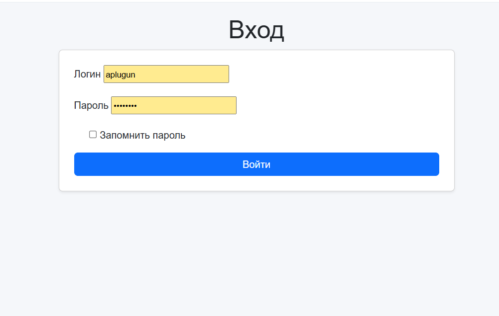
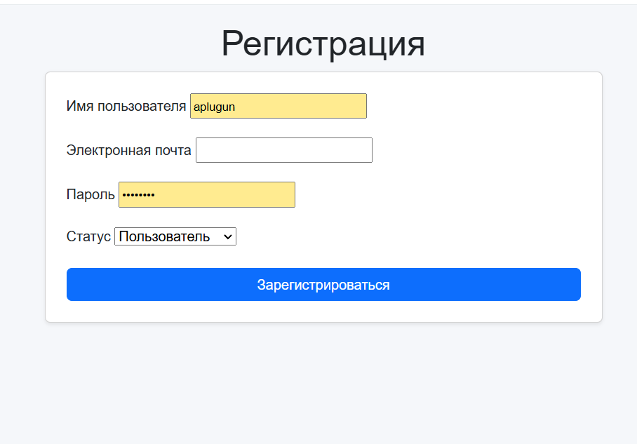

# Настройка и запуск веб-сайта на Django

## Анонс проекта

Добро пожаловать в наш проект **PharmaDB**! Это современное веб-приложение на основе Django. (Ранее pet-project Предсказание цен недвижимости в Москве). Проект использует Docker Compose для упрощения развертывания и PostgreSQL для надежного хранения данных. Присоединяйтесь к нам, чтобы упростить вашу работу с фармацевтическими данными!

## Обзор функционала со скриншотами

Ниже приведены основные функции приложения с пояснениями. Скриншоты помогут вам лучше понять возможности PharmaDB.

### 1. Главная страница
На главной странице вы найдете обзор доступных функций и быстрый доступ к основным разделам приложения.

  
*Скриншот главной страницы приложения, где отображаются ключевые функции и навигация.*

### 2. Вход и регистрация

  

 

### 3. Обучение моделей
Прогноз после передачи входных данных.

  

  
*Скриншот будущего раздела обучения моделей, показывающий настройки и прогресс обучения.*

### 4. Панель администратора
Для доступа к панели администратора создайте суперпользователя с помощью следующей команды внутри контейнера `web`:

```bash
docker-compose exec web bash
python manage.py createsuperuser
```

Пример выполнения:
```
root@436cb66dc179:/app# python manage.py createsuperuser
Имя пользователя (leave blank to use 'root'): aplug
Адрес электронной почты: a.plygun2005@gmail.com
Password: 
Password (again): 
Superuser created successfully.
```

После создания суперпользователя войдите в панель администратора по адресу `http://localhost:8000/admin/` с использованием указанных учетных данных.

  
*Скриншот панели администратора Django, где можно управлять пользователями и содержимым.*

---

## Описание проекта

Этот проект представляет собой веб-приложение на основе Django, развернутое с использованием Docker Compose и базы данных PostgreSQL. Следуйте инструкциям ниже, чтобы настроить и запустить сайт локально.

## Требования

Убедитесь, что на вашем компьютере установлены следующие инструменты:

- **Docker**: Установите Docker Desktop (для Windows/macOS) или Docker Engine (для Linux). [Скачать здесь](https://www.docker.com/get-started).
- **Docker Compose**: Входит в состав Docker Desktop или устанавливается отдельно на Linux (`sudo apt-get install docker-compose`).
- **Git**: Для клонирования репозитория (опционально).

## Структура проекта

Основные файлы и директории:

- `docker-compose.yml`: Определяет сервисы `web` (Django) и `db` (PostgreSQL).
- `Dockerfile`: Собирает контейнер для приложения Django.
- `entrypoint.sh`: Инициализирует базу данных, выполняет миграции и запускает сервер разработки Django.
- `.env`: Хранит переменные окружения (например, учетные данные базы данных).
- `manage.py`: Скрипт управления Django.
- `djangoProjectFirst/`: Директория проекта Django, содержащая `settings.py`.
- `firstblog/`: Директория приложения Django.
- `requirements.txt`: Зависимости Python для приложения Django.

## Инструкции по настройке

### 1. Клонирование репозитория

Склонируйте проект на свой компьютер (если еще не сделано):

```bash
git clone <url-репозитория>
cd <директория-репозитория>
```

### 2. Настройка переменных окружения

Создайте файл `.env` в корне проекта (или обновите существующий) со следующими переменными:

```env
DATABASE_HOST=db
DATABASE_USERNAME=postgres
DATABASE_NAME=pharmadb
DATABASE_PASSWORD=ваш_надежный_пароль
```

- Замените `ваш_надежный_пароль` на надежный пароль для базы данных PostgreSQL.
- Убедитесь, что файл `.env` не добавлен в систему контроля версий (добавьте его в `.gitignore`).

### 3. Сборка и запуск приложения

Выполните следующие команды из корневой директории проекта (где находится `docker-compose.yml`):

```bash
# Собрать образы Docker
docker-compose build

# Запустить сервисы
docker-compose up -d
```

- Флаг `-d` запускает контейнеры в фоновом режиме.
- Это запускает:
  - Сервис `web` (Django) на `http://localhost:8000`.
  - Сервис `db` (PostgreSQL) на порту `5432` (доступен для отладки).

### 4. Проверка работы приложения

- Откройте браузер и перейдите по адресу `http://localhost:8000`.
- Вы должны увидеть приложение Django (например, стартовую страницу или вашу кастомную главную страницу).
- Если интерфейс администратора включен, попробуйте `http://localhost:8000/admin/`.

Чтобы проверить статус контейнеров:

```bash
docker-compose ps
```

Ожидаемый вывод:

```
    Name                  Command               State           Ports         
--------------------------------------------------------------------------------
django        sh -c chmod +x /app/entr ...   Up      0.0.0.0:8000->8000/tcp
postgresdb    docker-entrypoint.sh post ...   Up      0.0.0.0:5432->5432/tcp
```

### 5. Выполнение команд управления Django (опционально)

Для выполнения команд Django (например, создания суперпользователя или проверки конфигурации):

```bash
# Войти в контейнер web
docker-compose exec web bash

# Внутри контейнера выполнять команды, например:
python manage.py createsuperuser
python manage.py check
```

Или запускать команды напрямую с хоста:

```bash
docker-compose exec web python manage.py createsuperuser
```

### 6. Остановка приложения

Чтобы остановить и удалить контейнеры:

```bash
docker-compose down
```

Чтобы также удалить том данных PostgreSQL (сброс базы данных):

```bash
docker-compose down -v
```

## Устранение неполадок

### Браузер не открывает `http://localhost:8000`

- **Проверка статуса контейнеров**:
  ```bash
  docker-compose ps
  ```
  Убедитесь, что контейнер `django` в состоянии `Up` и привязан к `0.0.0.0:8000->8000/tcp`.

- **Проверка конфликтов портов**:
  ```bash
  lsof -i :8000
  ```
  Если порт `8000` занят, остановите конфликтующий процесс или измените порт в `docker-compose.yml` (например, `8080:8000`).

- **Проверка подключения**:
  ```bash
  curl http://localhost:8000
  ```
  Если `curl` не работает, проверьте настройки брандмауэра или попробуйте `http://127.0.0.1:8000`.

- **Проверка `ALLOWED_HOSTS`**:
  Убедитесь, что в `djangoProjectFirst/settings.py` указано:
  ```python
  ALLOWED_HOSTS = ['localhost', '127.0.0.1', '0.0.0.0']
  ```

- **Проверка логов**:
  ```bash
  docker-compose logs web
  ```
  Ищите ошибки после строки `Starting development server at http://0.0.0.0:8000/`.

### Проблемы с подключением к базе данных

- Проверьте, что учетные данные в `.env` соответствуют `POSTGRES_USER`, `POSTGRES_PASSWORD` и `POSTGRES_DB` в `docker-compose.yml`.
- Убедитесь, что сервис `db` работает корректно:
  ```bash
  docker-compose logs db
  ```
  Ищите строку `database system is ready to accept connections`.

### WSL2 или удаленный сервер

Если вы используете WSL2 или удаленный сервер, `localhost` может не работать. Найдите IP-адрес хоста:

- **WSL2**:
  ```bash
  cat /etc/resolv.conf | grep nameserver | awk '{print $2}'
  ```
  Перейдите по адресу `http://<wsl2-ip>:8000`.

- **Удаленный сервер**:
  Используйте публичный или частный IP-адрес сервера.

## Примечания для разработки

- Сервер разработки Django (`runserver`) предназначен для локального тестирования. Для продакшена используйте WSGI-сервер, например `gunicorn`, с обратным прокси (например, Nginx).
- Данные PostgreSQL сохраняются в томе `postgres-data`. Используйте `docker-compose down -v` для сброса базы данных.
- Добавляйте новые зависимости Python в `requirements.txt` и пересобирайте:
  ```bash
  docker-compose build
  ```

## Вклад в проект

Чтобы внести вклад:

1. Сделайте форк репозитория.
2. Создайте ветку для новой функции (`git checkout -b feature/ваша-функция`).
3. Зафиксируйте изменения (`git commit -m "Добавлена ваша функция"`).
4. Отправьте ветку в репозиторий (`git push origin feature/ваша-функция`).
5. Откройте запрос на включение изменений (pull request).

## Лицензия

Проект распространяется под лицензией MIT. Подробности смотрите в файле `LICENSE`.
